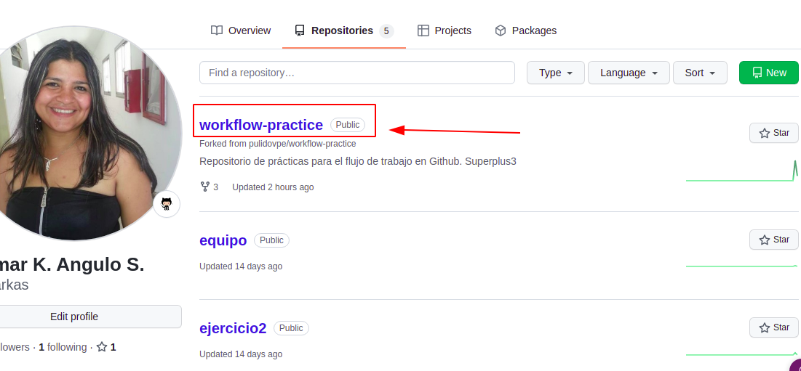
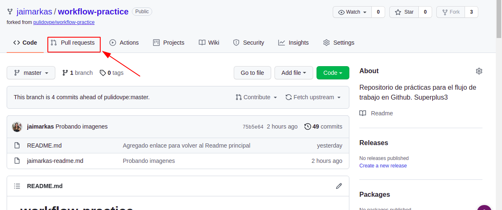
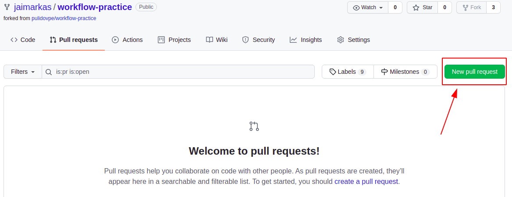
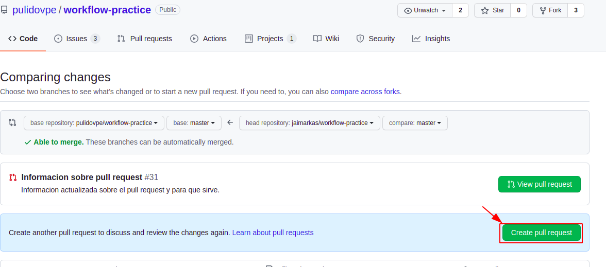
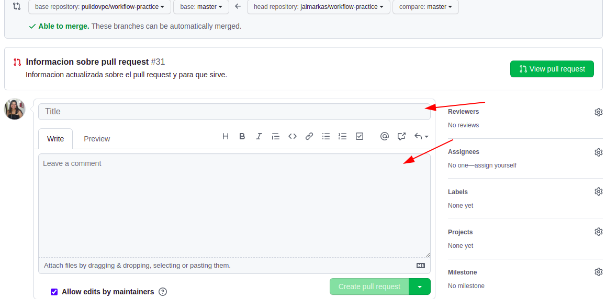

<a name="#inicio"></a>

#### Inicio


| #### **Indice** |  
| --- | 
| ***[Comandos en Git](#comandos-en-git)*** |
| ***[Git Head](#git-head)*** |
| ***[Git Remote](#git-remote)*** |
| ***[Git Branch](#git-branch)*** |
| ***[Git Tag](#git-tag)*** |
| ***[Git Rebase](#git-rebase)*** |
| ***[Otros Comandos](#otros-comandos)*** |
| ***[Pull request](#pull-request)*** |
| ***[Milestones](#milestones)*** |


#### Notas personales de Jaimar Angulo

<a name="#comandos-en-git"></a>

#### Comandos en Git


#### Para ver la version de git. Ejemplo:
```Shell
git version
```
#### Para ver solo el commit con el nombre. Ejemplo:
```Shell
git log --oneline
```
#### Para copiar un repositorio. Ejemplo:
```Shell
git clone <url>
```
#### Para subir al repositorio. Ejemplo:
```Shell
git push origin master
```
#### Para reeditar el ultimo commit. Ejemplo:
```Shell
git commit --amend -m "Texto que identifique porque se hizo el commit "
```
***[Volver al inicio](#inicio)***

<a name="#git-head"></a>

#### GIT HEAD

#### Saca un archivo del commit. Ejemplo:
```Shell
git reset Head <Archivo>
```
#### Devuelve el ultimo commit que se hizo y pone los cambios en staging. Ejemplo:
```Shell
git reset --soft HEAD^
```
#### Devuelve el ultimo commit y todos los cambios. Ejemplo:
```Shell
git reset --hard HEAD^
```
#### Devuelve los 2 ultimo commit y todos los cambios. Ejemplo:
```Shell
git reset --hard HEAD^^
```
***[Volver al inicio](#inicio)***

<a name="#git-remote"></a>

#### GIT REMOTE

#### Agregar repositorio remoto. Ejemplo:
```Shell
git remote add origin <url>
```
#### Cambiar de remote. Ejemplo:
```Shell
git remote set-url origin <url>
```
#### Remover repositorio. Ejemplo:
```Shell
git remote rm <name/origin>
```
#### Muestra lista repositorios. Ejemplo:
```Shell
git remote -v
```
#### Muestra los branches remotos. Ejemplo:
```Shell
git remote show origin
```
#### Limpiar todos los branches eliminados. Ejemplo:
```Shell
git remote prune origin
```
***[Volver al inicio](#inicio)***

<a name="#git-branch"></a>

#### GIT BRANCH

#### Crea un branch. Ejemplo:
```Shell
git branch <nameBranch>
```
#### Lista los branches. Ejemplo:
```Shell
git branch
```
#### Elimina el branch y lo une al master. Ejemplo:
```Shell
git branch -d <nameBranch>
```
#### Elimina sin preguntar. Ejemplo:
```Shell
git branch -D <nameBranch>
```
***[Volver al inicio](#inicio)***

<a name="#git-tag"></a>

#### GIT TAG

#### Muestra la lista de todos los tags. Ejemplo:
```Shell
git tag
```

#### Crea un nuevo tag. Ejemplo:
```Shell
git tag -a <version> -m "esta es la version x"
```
***[Volver al inicio](#inicio)***

<a name="#git-rebase"></a>

#### GIT REBASE  
#### Los rebase se usan cuando trabajamos con branches esto hace que los branches se pongan al dia con el master sin afectar al mismo.


#### Une el branch actual con el master, esto no se puede ver como un merge. Ejemplo:
```Shell
git rebase
```
#### Cuando se produce un conflicto nos da las siguientes opciones: Cuando resolvemos los conflictos --continue continua la secuencia del rebase donde se pauso. Ejemplo:
```Shell
git rebase --continue
```
#### Omite el conflicto y sigue su camino. Ejemplo:
```Shell
git rebase --skip
```
#### Devuelve todo al principio del rebase
```Shell
git rebase --abort
```
#### Para hacer un rebase a un branch en especifico. Ejemplo:
```Shell
git rebase <nameBranch>
```
***[Volver al inicio](#inicio)***

<a name="#otros-comandos"></a>

#### OTROS COMANDOS

#### Lista un estado actual del repositorio con lista de archivos modificados o agregados. Ejemplo:
```Shell
git status
```
#### Quita del HEAD un archivo y le pone el estado de no trabajado. Ejemplo:
```Shell
git checkout -- <file>
```
#### Une el branch actual con el master, esto no se puede ver como un merge. Ejemplo:
```Shell
git rebase
```
#### Crea un branch en base a uno oneline. Ejemplo:
```Shell
git checkout -b newlocalbranchname origin/branch-name
```
#### Busca los cambios nuevos y actualiza el repositorio. Ejemplo:
```Shell
git pull
```
#### Cambiar de branch. Ejemplo:
```Shell
git checkout <nameBranch/tagname>
```
#### Une el branch actual con el especificado. Ejemplo:
```Shell
git merge <nameBranch>
```
#### Verifica cambios en el repositorio oneline con el local. Ejemplo:
```Shell
git fetch
```
#### Borrar un archivo del repositorio. Ejemplo:
```Shell
git rm <archivo>
```
***[Volver al inicio](#inicio)***

<a name="#pull-request"></a>

#### PULL REQUEST

#### ¿Qué es un pull request?
```Shell
Un pull request es una petición que el propietario de un fork de un repositorio hace al propietario del repositorio original para que este último incorpore los commits que están en el fork. 
```
#### Pasos para solicitar un pull request

```Shell 
1. Ir al repositorio en el que estamos trabajando en GitHub.
```
#### **Observar la siguiente imagen** 


```Shell
2. Darle click al repositorio que le vamos hacer el pull request.
```
#### **Observar la siguiente imagen**


```Shell
3. Darle click a la opcion Pull request.
```
#### **Observar la siguiente imagen**



```Shell
4.Darle click a la opcion New pull request
```
#### **Observar la siguiente imagen**



```Shell
5. Darle click a la opcion Create pull request
```
#### **Observar la siguiente imagen**



```Shell
6. En la casilla del titulo, colocar la informarcion de los cambios que se hicieron y en la parte de abajo colocar la mayor descripcion posible sobre los cambios
```
#### **Observar la siguiente imagen**



**Y asi finaliza los pasos para solicitar un _pull request_, los demas pasos quedan pendiente por el _dueño_ del proyecto.**

<a name="#milestones"></a>

#### Milestones

#### Explicar que son los Milestones

```Shell
Estas son categorías que se utilizan en las issues para tener un filtro más adecuado de la información.
```

***[Volver al inicio](#inicio)***

***[Volver al Readme](README.md)***
